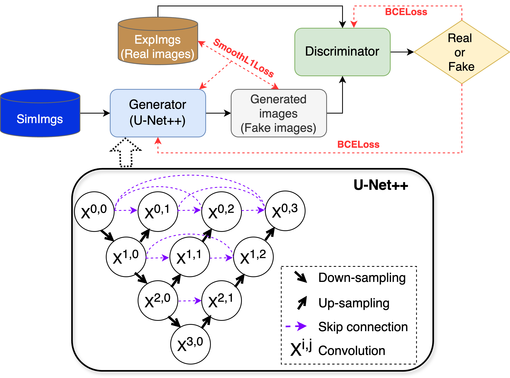

<!-- <div align="center"> -->
# Struc2mapGAN: Synthesizing High-resolution Experimental-like Cryo-EM Density Maps with Generative Adversarial Networks
<!-- </div> -->


[](https://arxiv.org/abs/2407.17674)


## About Struc2mapGAN
Struc2mapGAN is a novel data-driven method that employs a generative adversarial network (GAN) with a U-Net++ architecture as the generator to produce high-resolution experimental-like density maps from molecular structures (PDB files). 

<!--     -->
<div align="center">
    
</div>


## Pre-required software

```
Python 3 : 
https://www.python.org/downloads/  

UCSF ChimeraX :
https://www.cgl.ucsf.edu/chimerax/download.html
```


## Dependencies
```
numpy<2.0
torch==2.2.2
lightning==2.2.3
```

## Installation

```bash
# Create conda environment
conda create -n struc2mapGAN python=3.10
conda activate struc2mapGAN

# CLone git repo
git clone https://github.com/chenwei-zhang/struc2mapGAN.git
cd struc2mapGAN

# Install dependencies
pip install -r requirements.txt
```

## Download Checkpoints
In case ```git clone``` did not successfully download the pretrained model thereby casuing running errors, please go through this [Google Drive Link](https://drive.google.com/file/d/1xReT4R_CeYzCE8u31MES2fTjMk0MflNj/view?usp=drive_link) to download the pretrained model, and make sure to place the downloaded checkpoint in the correct path (```struc2mapGAN/ckpt/struc2mapGAN.ckpt```).


## Usage
```bash
cd struc2mapGAN/app

# Generate maps
python struc2mapGAN.py --pdb ../example/8i2h_ref.pdb --ckpt ../ckpt/struc2mapGAN.ckpt --output_mrc ../example/8i2h_struc2mapGAN.mrc

# If resample to experimental map's box size
python struc2mapGAN.py --pdb ../example/8i2h_ref.pdb --ckpt ../ckpt/struc2mapGAN.ckpt --output_mrc ../example/8i2h_struc2mapGAN.mrc --ref_map ../example/emd_35136.map
```

### Commands

- --pdb <pdb_path>  Path to the input pdb file
- --ckpt <ckpt_path>  Path to the trained checkpoint
- --output_mrc <output_path> Path to the output map
- --ref_map <map_path> Path to the reference map file if resample to the original experimental map's box size


## Generated Map Library 

Please visit the OSF space at https://osf.io/zcxvs/ to view all the test maps generated using struc2mapGAN.


## Contact

Chenwei Zhang (cwzhang@cs.ubc.ca)


## License

This project is licensed under the GNU General Public License v3.0 - see the [LICENSE](LICENSE) file for details.